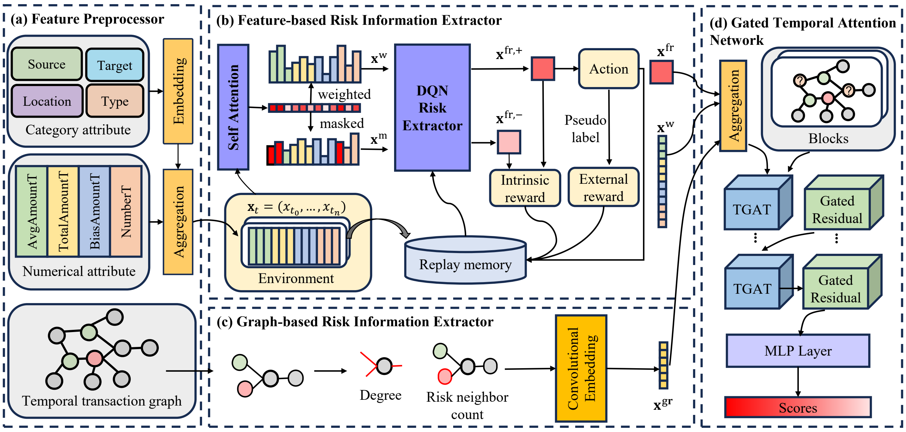

# DRESS

The implementation of **"Deep Reinforcement Learning Enhanced Semi-supervised Graph Neural Network for Credit Card Fraud Detection"** (IJCAI 2026).



## Environment Setup

- Python 3.7
- PyTorch 1.12.1 + CUDA 11.3
- DGL 0.8.1
- numpy, pandas, scikit-learn, scipy, PyYAML, tqdm

```bash
conda create -n dress python=3.7
conda activate dress
pip install -r requirements.txt
pip install -e .
```

If you use CUDA, install the PyTorch and DGL builds matching your local CUDA runtime.

## Datasets

We conduct experiments on three fraud detection datasets:

- **YelpChi**: A review spam detection graph benchmark from [CARE-GNN](https://dl.acm.org/doi/abs/10.1145/3340531.3411903); the original processed data can be found in the [CARE-GNN repository](https://github.com/YingtongDou/CARE-GNN/tree/master/data).
- **Amazon**: A user-product review fraud graph benchmark from [CARE-GNN](https://dl.acm.org/doi/abs/10.1145/3340531.3411903); the original processed data can be found in the [CARE-GNN repository](https://github.com/YingtongDou/CARE-GNN/tree/master/data).
- **S-FFSD**: A simulated small financial fraud semi-supervised dataset released in the [AntiFraud framework](https://github.com/AI4Risk/antifraud).

Place datasets under `data/` by default:

```text
data/
  S-FFSDneofull.csv
  S-FFSD_neigh_feat.csv
  YelpChi.mat
  yelp_homo_adjlists.pickle
  Amazon.mat
  amz_homo_adjlists.pickle
```

You can set a custom path through `data_dir` in `configs/DRESS_cfg.yaml`.

## Running the Code

Run DRESS with the default configuration:

```bash
python -m dress.train --config configs/DRESS_cfg.yaml
```

Main configuration options:

- `dataset`: one of `S-FFSD`, `yelp`, or `amazon`
- `data_dir`: directory containing benchmark files
- `device`: training device, for example `cuda:0` or `cpu`
- `intrinsic_reward`: enable the self-supervised intrinsic reward
- `ml_risk_score`: use the ML risk-score alternative when intrinsic reward is disabled

The trained checkpoint is saved to `checkpoints/DRESS_ckpt.pth` by default.

## Project Structure

```text
.
|-- assets/figures/          # Framework figure for README
|-- checkpoints/             # Released model checkpoint
|-- configs/                 # Training configuration
|-- docs/                    # Data notes
|-- feature_engineering/     # Dataset feature engineering utilities
`-- src/dress/               # DRESS implementation
```

## Citation

If you find this project helpful, please cite our paper:

```bibtex
@inproceedings{he2026dress,
  title = {Deep Reinforcement Learning Enhanced Semi-supervised Graph Neural Network for Credit Card Fraud Detection},
  author = {He, Huilin and Zhu, Kun and Hu, Zewen and Wang, Jie and Cheng, Dawei},
  booktitle = {Proceedings of the International Joint Conference on Artificial Intelligence (IJCAI)},
  year = {2026}
}
```

## Acknowledgements

This codebase is built upon the [RGTAN implementation](https://github.com/AI4Risk/antifraud/tree/main/methods/rgtan) in the [AntiFraud](https://github.com/AI4Risk/antifraud) framework. We thank the authors for releasing their code and datasets.
